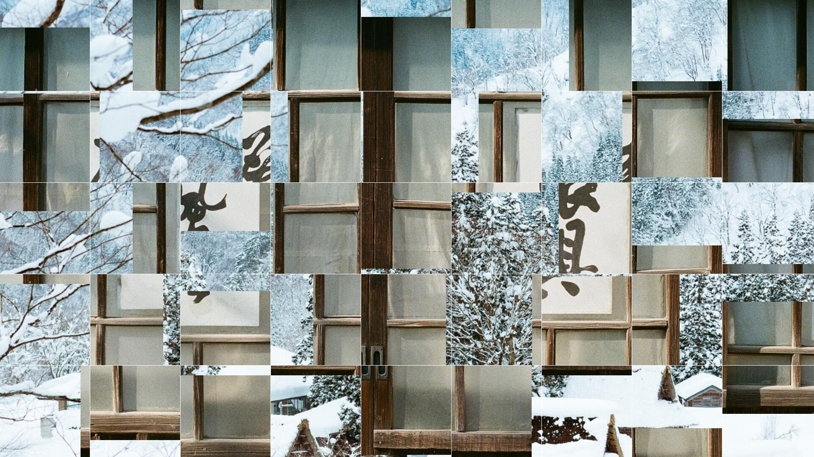

[](https://github.com/ymback/vue-fucking-gallery/stargazers)
[](https://github.com/ymback/vue-fucking-gallery/issues)
[](https://github.com/ymback/vue-fucking-gallery/network)
[](https://github.com/ymback/vue-fucking-gallery)  
[](https://www.npmjs.com/package/vue-fucking-gallery)
[](https://www.npmjs.com/package/vue-fucking-gallery)

# Vue Fucking Gallery (v3.x)

基于 Vue 3 的相册组件，使用WebGL绘制
For english user, read [here](README-EN.md)

> ⚠️ **注意：** v3.x 版本已切换至 **Vue 3 + Vite** 架构，如果你的项目仍在使用 Vue 2，请安装使用 v1.x 版本。

## 说明

* 这是一个会让你不停骂"操"的操蛋相册组件库，配置的时候，你会骂一句"操"，搞完了刷新网页，你还会骂一句"操"！
* 你可以完全不配置任何选项，直接使用
* 支持动画持续时间、等待时间配置
* 支持设置动画单元的行进方向，支持流水式进入及整行/整列进入
* 支持大量预设动画时间曲线
* 大部分参数支持随机配置
* 支持配置图片地址数组，或使用[Unsplash](https://unsplash.com/)随机图片
* [Unsplash](https://unsplash.com/)随机图片支持标签设置
* 首张图片绘制后会立即预加载下一张，动画结束后无缝切换展示
* 支持图片动画期间透明度设置
* 支持分割线及其颜色配置
* 独特的贪吃蛇模式
* 接入 Unsplash 官方 API，动态计算容器比例，结合 `devicePixelRatio` 智能拉取 Retina 级完美适配的高清美图。
* 当 Unsplash 密钥未配置或请求失败超限时，自动无缝降级至 `LoremFlickr` 占位图，保证页面绝不白屏！

## 示例

[示例地址](http://gallery.sayyoulove.me/#/)  
  
[](example/1.jpg "示例 1")
[](example/2.jpg "示例 2")
[](example/3.jpg "示例 3")
[](example/4.jpg "示例 4")

## 浏览器支持

所有现代浏览器，需支持 WebGL 2.0。

**性能特性：**
- 采用 WebGL 2.0 + 双缓冲渲染管线，优化 Android 设备性能
- 动态属性使用 FLOAT32 数据类型，规避低端 Mali/Adreno 驱动慢路径
- 静态底图缓存（FBO）机制，减少动画期间的重复绘制
- 自动单帧混合渲染和 dirty rectangle 优化
- Safari 初始化兼容性修复，确保首屏渲染正确

## 安装

### NPM

``` bash
$ npm install vue-fucking-gallery
```

## 引入 (Vue 3 方式)

``` javascript
import { createApp } from 'vue'
import App from './App.vue'
import VueFuckingGallery from 'vue-fucking-gallery'

const app = createApp(App)
app.use(VueFuckingGallery)
app.mount('#app')
```

## 使用

### 基础

```vue
<template>
    <vue-fucking-gallery class="gallery"></vue-fucking-gallery>
</template>

<style>
/* 相册组件必须设定宽度和高度 */
.gallery {
  width: 100%;
  height: 100%;
  margin: 0;
}
</style>
```

### 进阶

```vue
<template>
    <vue-fucking-gallery 
        :element-id="id" 
        :grid-max-width="gridMaxWidth"
        :grid-max-height="gridMaxHeight"
        :grid-divider-width="gridDividerWidth"
        :grid-divider-color="gridDividerColor"
        :slide-wait-time="slideWaitTime"
        :use-animate="useAnimate"
        :animate-speed="animateSpeed"
        :animate-speed-delay="animateSpeedDelay"
        :animate-item-direction="animateItemDirection"
        :animate-row-direction="animateRowDirection"
        :animate-column-direction="animateColumnDirection"
        :animate-show-order="animateShowOrder"
        :animate-effect="animateEffect"
        :canvas-animate-easing="canvasAnimateEasing"
        :image-list="imageList"
        :use-un-splash="useUnSplash"
        :un-splash-tag="unSplashTag"
        :un-splash-access-key="unSplashAccessKey"
        :init-load-finish-callback="initLoadFinishCallback"
        :photo-load-success-callback="photoLoadSuccessCallback"
        :animate-begin-callback="animateBeginCallback"
        :animate-end-callback="animateEndCallback"
        class="gallery"></vue-fucking-gallery>
</template>

<style>
/* 相册组件必须设定宽度和高度 */
.gallery {
  width: 100%;
  height: 100%;
  margin: 0;
}
</style>
```

## 配置选项
所有的配置选项均是响应式的，并且除非是需要重置页面布局的，否则不会停止当前动画并直接绘制下一张。

### 基础配置

| 名称 | 类型 | 默认值 | 说明 |
| ---- | ---- | ---- | ----------- |
| elementId | String | `'vue-fucking-gallery'` | 相册元素的ID |
| gridMaxWidth | Integer | `200` | 每个动画单元的最大宽度，基于性能考虑，不要小于`48` |
| gridMaxHeight | Integer | `200` | 每个动画单元的最大高度，基于性能考虑，不要小于`48` |
| gridDividerWidth | Integer | `1` | 动画单元之间的分割线，可以设置为`0` |
| gridDividerColor | String | `'#fff'` | 分割线颜色，支持3位或6位Hex色值，例如`'#fff'`或`'#ffffff'` |
| useAnimate | Boolean | `true` | 是否使用动画，不使用动画将直接在等待时间完成后绘制下一张图片 |
| slideWaitTime | Integer | `5000` | 每次动画完毕到下一次动画开始前的等待时间，单位为毫秒；小于`1000`时会自动按`1000`处理 |
| animateSpeed | Integer | `150` | 动画速度，与`animateSpeedDelay`值共用以确定动画运行时间，单位为毫秒；小于`100`时会自动按`100`处理 |
| animateSpeedDelay | Integer | `10` | 动画运行速度积，与`animateSpeed`值共用以确定动画运行时间；小于`5`时会自动按`5`处理 |
| animateItemDirection | String | `'left'` | 每个动画单元的行进方向，在以下选项中选择<br/>`'left'`: 从左到右<br/>`'top'`: 从上到下<br/>`'right'`:从右到左<br/>`'bottom'`: 从下到上<br/>`'random'`: 全部随机，使用该值，则`animateShowOrder`会强制使用`'random'`<br/>`'none'`: 不使用移动效果，使用该值，则`animateEffect`会强制使用`'opacity'`<br/>`'snake'`: 贪吃蛇模式，使用该值，则起始位置强制为左上第一个，逆时针绕圈，`animateShowOrder`会强制使用`'singleItem'` |
| animateRowDirection | String | `'left'` | 每一行的展示方向，在以下选项中选择<br/>`'left'`: 每行中动画单元从左到右展示<br/>`'right'`: 每行中动画单元从右到左展示<br/>`'random'`: 随机选择`'left'`或者`'right'` |
| animateColumnDirection | String | `'top'` | 每一列的展示方向，在以下选项中选择<br/>`'top'`: 每列中动画单元从上到下展示<br/>`'bottom'`: 每列中动画单元从下到上展示<br/>`'random'`: 随机选择`'top'`或者`'bottom'` |
| animateShowOrder | String | `'singleItem'` | 动画单元的展示间隔,具体时间间隔由`animateSpeed`和`animateSpeedDelay`共同决定，在以下选项中选择<br/>`'singleItem'`: 每个动画单元会在上一个动画单元出现后再出现<br/>`'multiLine'`: 每一行/列的动画单元会一起出现，并按照`animateItemDirection`指定的方向开始整行/列出现<br/>`'random'`: 随机设置每个动画单元的动画开始时间 |
| animateEffect | String | `'opacity'` | 动画单元的效果，在以下选项中选择<br/>`'opacity'`: 从完全透明到完全不透明<br/>`'none'`: 不使用效果<br/>`'sameRandom'`: 所有动画单元随机选择`'opacity'`和`'none'`中的一个<br/>`'eachRandom'`: 每个动画单元单独随机选择 |
| imageList | Array | `[]` | 设置的图片列表，为空则自动使用 UnSplash 服务 |
| useUnSplash | Boolean | `false` | 是否使用 UnSplash 服务，即使设置为`false`，如果`imageList`为空，依然会按`true`处理 |
| unSplashTag | String | `'japan'` | UnSplash 的图片标签，不同的标签会返回符合不同标签的随机图片 |
| unSplashAccessKey | String | `''` | **(v2.0 新增)** 你的 Unsplash Access Key。请前往 [Unsplash Developers](https://unsplash.com/developers) 申请。如果不填或请求超限，组件将自动降级使用免费的占位图服务以保证页面正常运转。 |
| assumeOpaqueTextures | Boolean | `false` | **(v3.0 新增)** 假设图片纹理完全不透明，启用此选项可跳过混合状态管理以提升性能（需确保图片无透明区域） |
| initLoadFinishCallback | Function | `null` | 初始化读取第一张图片完成后的回调 |
| photoLoadSuccessCallback | Function | `null` | 读取图片完成后的回调，包括第一次读取图片完成也会回调 |
| animateBeginCallback | Function | `null` | 动画开始的回调 |
| animateEndCallback | Function | `null` | 动画结束的回调，携带参数 `stats` 性能统计对象，包含：`frames`（总帧数）、`bufferUploads`（缓冲上传次数）、`textureUploads`（纹理上传次数）、`sharedStaticHits`（静态缓存命中）、`singlePassHits`（单帧混合命中）、`animatedInstancesPeak`（峰值动画单元数）等 |
| canvasAnimateEasing | String | `'SinusoidalInOut'` | 动画时间曲线，包含 `'Linear'` `'QuadraticIn'` `'QuadraticOut'` `'QuadraticInOut'` `'CubicIn'` `'CubicOut'` `'CubicInOut'` `'QuarticIn'` `'QuarticOut'` `'QuarticInOut'` `'QuinticIn'` `'QuinticOut'` `'QuinticInOut'` `'SinusoidalIn'` `'SinusoidalOut'` `'SinusoidalInOut'` `'ExponentialIn'` `'ExponentialOut'` `'ExponentialInOut'` `'CircularIn'` `'CircularOut'` `'CircularInOut'` `'ElasticIn'` `'ElasticOut'` `'ElasticInOut'` `'BackIn'` `'BackOut'` `'BackInOut'` `'BounceIn'` `'BounceOut'` `'BounceInOut'`参数值，另外有如下两个随机选项<br/>`'sameRandom'`: 所有的动画单元随机选择使用前面曲线中的某一个，但是均为同一个<br/>`'eachRandom'`: 每个动画单元单独随机选择使用前面曲线中的某一个 |

## 性能优化特性 (v3.0+)

该版本引入了多项性能优化，特别针对低端设备和 Android 平台进行了优化：

| 特性 | 说明 | 启用条件 |
| ---- | ---- | ----------- |
| **FLOAT32 数据布局** | 采用 24 字节对齐的 FLOAT32 属性格式，规避 Mali/Adreno GPU 的 HALF_FLOAT 慢路径 | 默认启用 |
| **静态底图缓存** | 使用 FrameBuffer Object (FBO) 缓存不变的静态渲染层，避免动画期间重复绘制 | 自动检测 |
| **Single-Pass 混合** | 当新旧纹理尺寸相同且无空间动画时，在单个 pass 中完成混合渲染 | 自动检测 |
| **Old Pass Bypass** | 当所有动画单元都透明且无空间移动时，跳过旧图层渲染 | 自动检测 |
| **Dirty Rectangle** | 只渲染受动画影响的区域，减少像素填充工作量 | 自动启用 |
| **不透明假设** | 设置 `assumeOpaqueTextures: true` 后，禁用混合状态管理以进一步提升性能 | 手动启用 |
| **Safari 初始化修复** | 自动处理 Safari WebGL 2.0 上下文初始化的时序问题，确保首屏渲染正确 | 默认启用 |

## 注意

* 当你修改上方配置的值时，本组件会响应新配置，按照新配置进行绘制，其中部分参数修改后，如若正在动画期间，则动画立即结束，回调`animateEndCallback`，立即绘制下一张图片并继续进行图片加载。
* 如果使用 `imageList` 传入图片，但所有其中的图片都加载失败了，本组件会停止加载，直到你重新设置配置后，重新响应新配置。
* 本组件会判断连续两张图片是否完全相同，完全相同则不使用第二张图片，继续读取下一张图片。
* 浏览器窗口触发 `resize` 事件时，系统会自动丢弃后台比例不匹配的旧图，并根据全新的窗口尺寸重新获取一张完美契合的图片进行无缝替换。